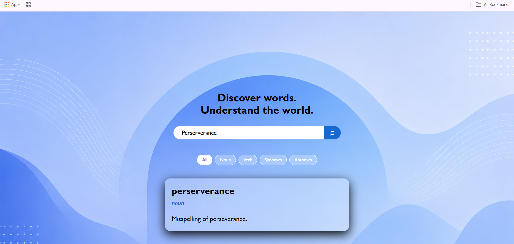

# 📖 Dictionary App

A simple and user-friendly dictionary web application built using HTML, CSS and JavaScript.

The app allows users to search for words and view their meanings along with different word categories.

## 🚀 Features

- 🔍 Search for words
- 📖 Display word meanings
- 🟢 Noun and Verb options
- 🔵 Synonyms
- 🔴 Antonyms
- 📱 Simple and clean user interface
- ⚡ Fetches data using a Dictionary API

## 🛠️ Technologies Used

- HTML
- CSS
- JavaScript
- Dictionary API

## 🌐 Live Demo

[Click here to view the Dictionary App]
(https://keshavnain.github.io/Dictionary-app/)

## 📸 Screenshot

## 🎯 What I Learned

While building this project, I practiced:

- Working with JavaScript
- Using APIs and `fetch()`
- Handling user input
- Working with JSON data
- DOM manipulation
- Creating interactive web pages
- Using HTML and CSS to design a responsive interface

## 👨‍💻 Author

**Keshav Nain**

B.Tech CSE Student | Learning Web Development
